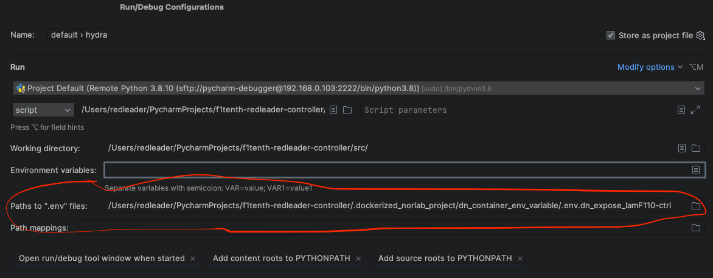
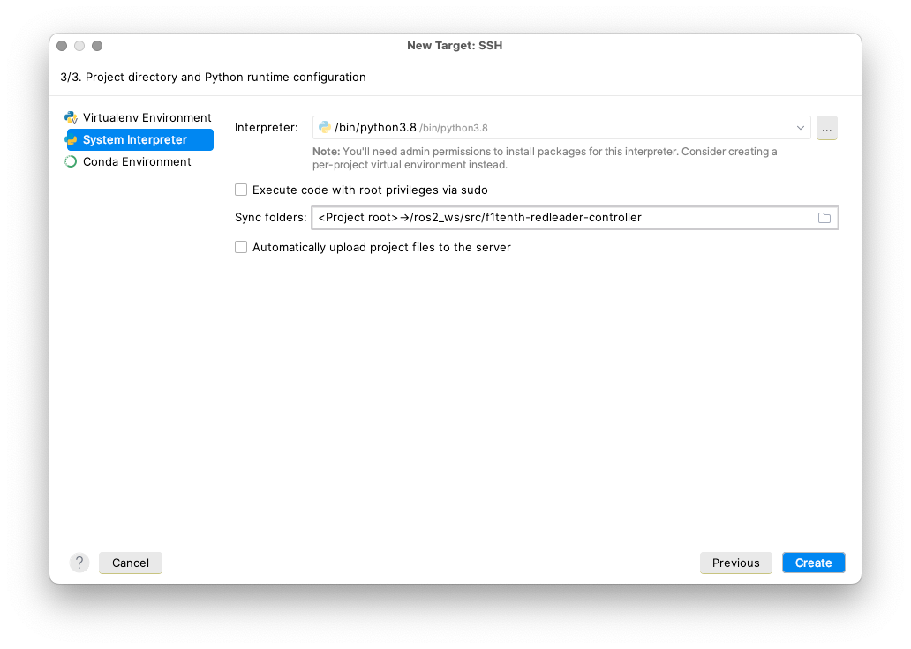
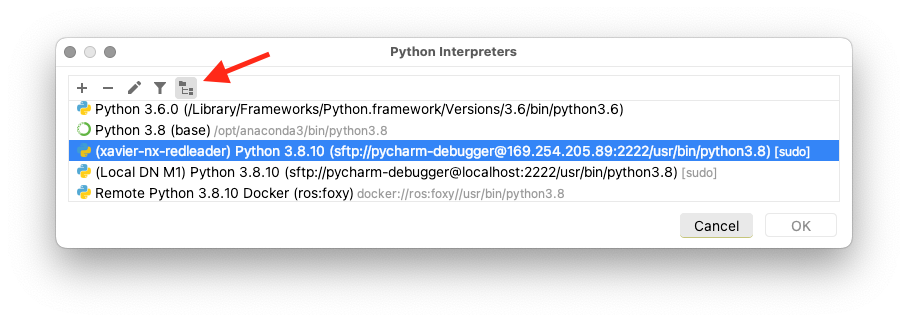
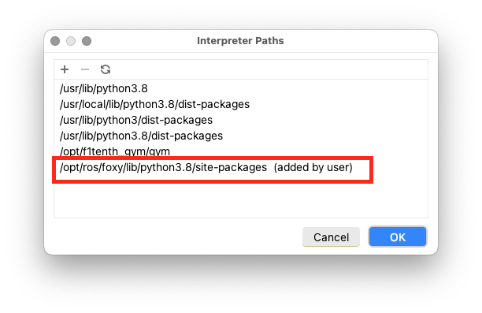
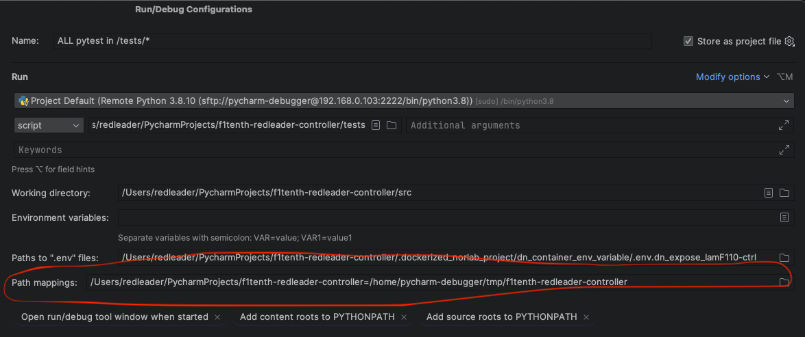

# Dockerized-NorLab Project

## Usage

1. Setup/validate `.dockerized_norlab_project/configuration/.env`
2. Customize files in `.dockerized_norlab_project/configuration/project_requirements/`. Add
3. Customize files in `.dockerized_norlab_project/configuration/project_entrypoints/`. Add
   project-specific container runtime logic.
4. Customize any `Dockerfile` or `docker-compose.*.yaml` to fit your need. It should work out of
   the box for most use cases.
5. From your project `src/lib/core/execute/` directory, execute the following
    ```shell
    cd src/lib/core/execute/
   
    # Build your DN-project containers 
    bash build.all.bash 
    # Start your DN-project containers 
    bash up_and_attach.bash
    # Have fun
    # When your done, execute 
    bash down.bash
    ```

## Requirements:

- dependencies:
    - [Docker](https://docs.docker.com/engine/install/ubuntu/#install-using-the-repository) with
      `docker-buildx-plugin` and `docker-compose-plugin`
    - [nvidia-docker](https://github.com/NVIDIA/nvidia-docker) for GPU usage
- The directory `.dockerized_norlab_project` need to be at the super-project repository root
- (TODO: implement submodule) `dockerized-norlab-project-tools` should be cloned as a git submodule
  in the `utilities/`
  directory i.e.  `utilities/dockerized-norlab-project-tools`

# Setup PyCharm IDE

### Remote development
- To work in a docker container on a remote machine, setup a remote developement configuration pointing to `<remote-machine-user>@<target-host-IP>:<remote-machine-ssh-port>` e.g.: `redleader@192.168.0.103:22`.
- Set `rsync` ON and sudo OFF
- Make sure `rsync` DO copy the `.git` directory to the remote host i.e. check if it is in the rsync excluded item list 
- **Remote display**:
  - Start your DN container project using script `src/lib/core/execute/up_and_attach.bash`
  - In the remote docker container terminal, execute command alias `dn_expose_container_env_variables` and download `.dockerized_norlab_project/dn_container_env_variable/.env.dn_expose_<DN_CONTAINER_NAME>`  to your source machine
   and set `Paths to ".env" files` in run configuration window 
    

#### Rsync to remote machine
- If you encounter rsync error such as the infamous `exit code 23`, check file/dir permission and group by executing `tree -aug <path/to/remote/project/dir>` and update them if needed by executing `sudo chown -R $(id -un):$(id -gn) <path/to/remote/project/dir>`. 

### Python interpreter
- Set up a ssh remote python interpreter pointing to `<dockerized-norlab-ssh-user>@<target-host-IP>:<dockerized-norlab-container-ssh-port>` e.g.: `pycharm-debugger@192.168.0.103:2222`. Note: use `localhost` explicitly if the container is running on your local machine i.e.: `pycharm-debugger@localhost:2222`
- Remote python interpreter, i.e. `<user-name>@<remote-ip-adress>:2222`:
  - ⚠️ Uncheck `Execute code with root privileges` otherwise experimental data writen to disk will be owned by `root` instead of `DN_PROJECT_USER`
  - ⚠️ Uncheck `Automatically upload project files`. The project is mounted as a docker volume for develop images and is copied at build stage for deploy images.
  - Set path mapping to `/ros2_ws/src/<DN_PROJECT_GIT_NAME>` or delete the `Sync folders` entry.
  
- Don't forget to add `/opt/ros/<distro>/lib/python<version>/site-packages` to the _Interpreter
  path_ once the docker based ssh interpreter is configured,
  e.g.: `/opt/ros/foxy/lib/python3.8/site-packages`

  
  

### Run/debug configuration 

- Don't forget to set run/debug configuration `path mapping` to: `~/PycharmProjects/RedLeader-research-codebase` -> `/ros2_ws/src/RedLeader-research-codebase`. It's critical for debug breakpoint remote/local resolution to work in regular/pytest run, regular/pytest debug and for IDE debug stacktrace remote/local code resolution for jumping to source code from stacktrace link.
  
